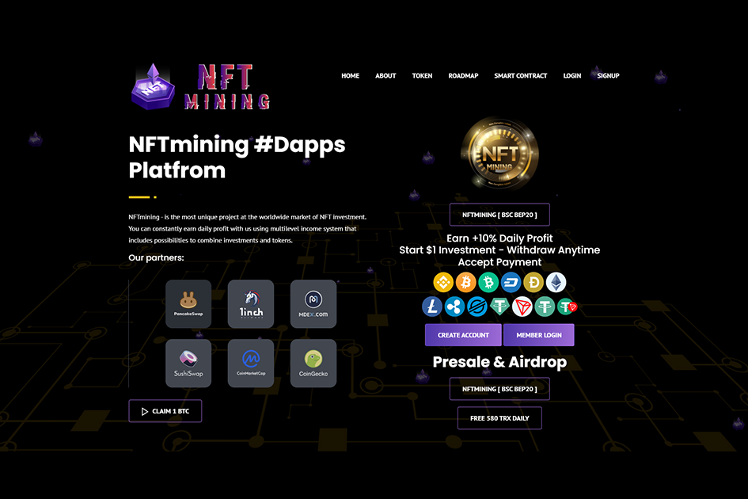

今天的 NFT 市场 NFT 或不可替代的代币在过去六个月中变得非常流行，对于数字投资者来说是一种有吸引力的工具和新的可能性。这些货币的技术性质允许在版权领域有效地使用它们。图片、歌曲甚至报纸专栏几乎每天都被数字化并以数十万美元的价格出售。我们如何赚钱 新手和有经验的用户都很难了解市场上出现的 NFT 多样性并购买价格上涨的最先进的 NFT，但市场上出现的假冒或被盗作品也很难。NFT 的流行吸引了很多 gyps 进入市场，他们使用他人的作品来创建 NFT 并声称拥有作者身份。即使是有经验的用户也可以购买借来的作品。

