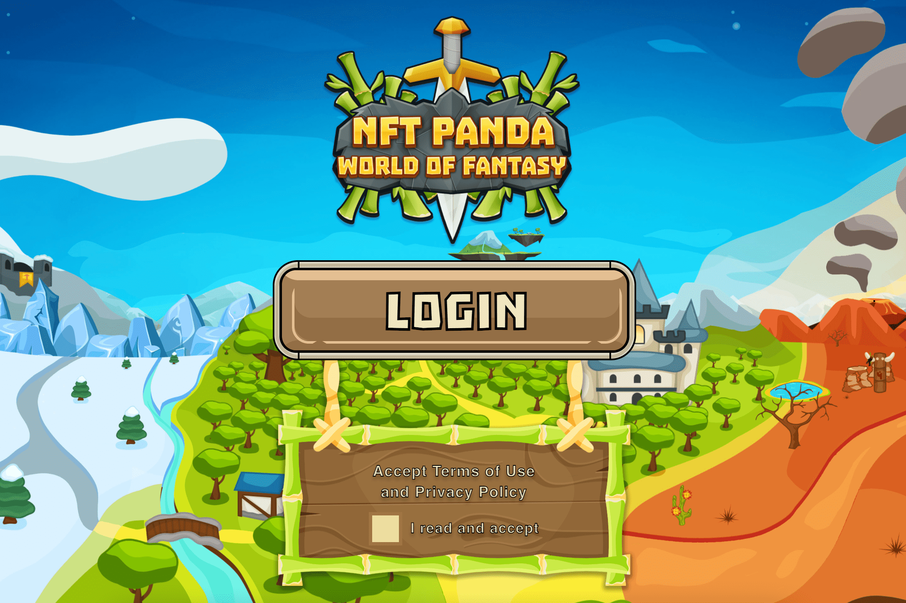

---
title: "NFT Panda: World of Fantasy"
description: "NFT Panda: World of Fantasy 是 WAX 区块链上的 RPG 游戏，熊猫的幻想英雄在这里生活并为他们的土地自由而战。"
date: 2022-08-19T00:00:00+08:00
lastmod: 2022-08-19T00:00:00+08:00
draft: false
authors: ["浮尘"]
featuredImage: "nft-panda-world-of-fantasy.png"
tags: ["NFT Games","NFT Panda: World of Fantasy"]
categories: ["nfts"]
nfts: ["NFT Games"]
blockchain: "WAX"
website: "https://game.nftpanda.space/"
twitter: "https://twitter.com/NftPanda"
discord: "https://discord.com/invite/vCSgme4d5b"
telegram: ""
github: ""
youtube: ""
twitch: ""
facebook: ""
instagram: "https://www.instagram.com/accounts/login/?next=/nftpanda/"
reddit: ""
medium: "https://nftpanda.medium.com/"
steam: ""
gitbook: "https://nft-panda.gitbook.io/nft-panda/"
googleplay: ""
appstore: ""
status: "Live"
weight: 
lightgallery: true
toc: true
pinned: false
recommend: false
recommend1: false
---
NFT Panda: World of Fantasy是一个熊猫幻想英雄为他们的土地自由而生活和战斗的世界。你的任务是成为一个英雄，他将重新统一埃尔加德的土地，并将他们带回昔日的繁荣。NFT Panda: WoF 是一个独特的以玩家为中心的代币经济学模型，主要旨在实现真正的 Play-to-Earn机制。

