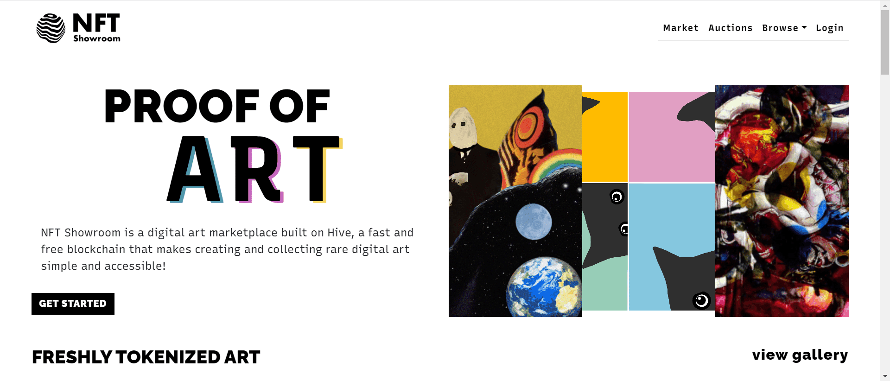

NFT Showroom 是一个基于 Hive 区块链的数字艺术市场。Hive 是一个快速且无感觉的区块链，可扩展，可在全球范围内访问，并解锁艺术之外的整个生态系统。我们的目标是提供一个易于使用的平台来创建和收集稀有的数字艺术！

艺术家可以注册他们的数字创作并发行稀有代币，“艺术证明”可以在市场上交易。了解更多关于以艺术家身份加入的信息。

Hive 使收集稀有的数字艺术变得容易。浏览我们来自世界各地的不同艺术家的画廊并开始您的收藏。

