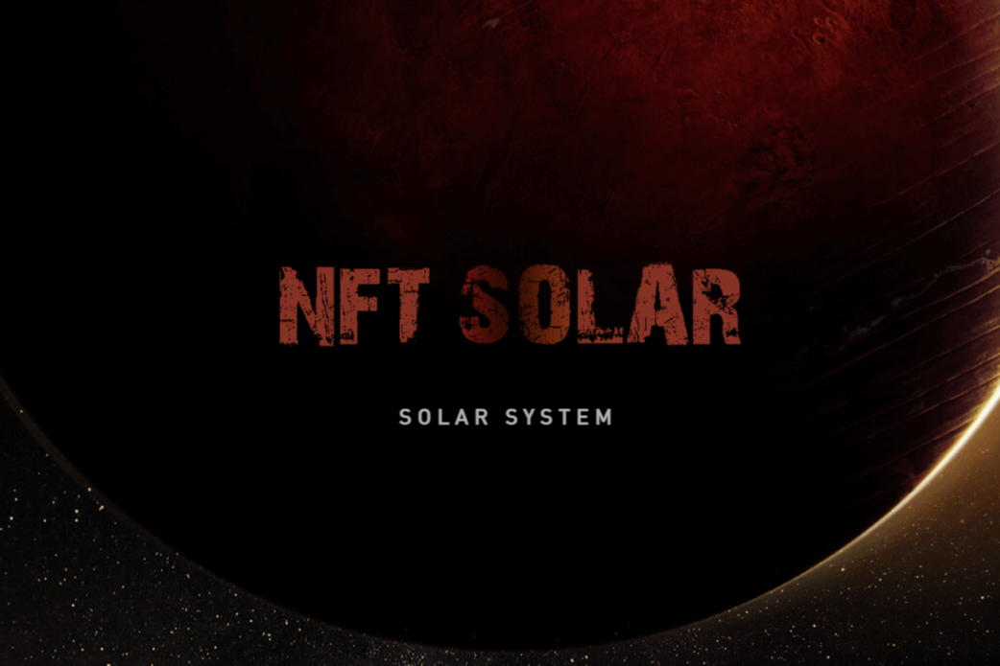

创建您自己独特的太阳能系统

预售已经开始。

参与售前准备。获得低价购买 SNS 代币的机会。

NFT太阳能平台

建立自己独特的太阳系

用 NFT 为自己购买一个星球或一个国家，你真的可以做到！

在太阳系的 beta 版本中，某些功能不可用。

但现在有机会建立自己的太阳系，购买行星、恒星和国家。

在您的帮助下，我们将能够在不久的将来启动该平台。

释放

启动发布后。你将能够建立你的太阳系。与其他成员购买和交换 NFT 行星。

