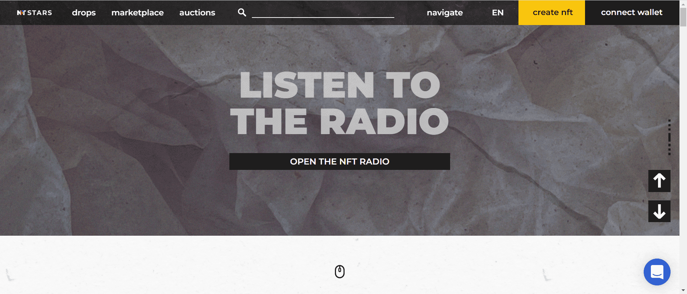

NFT STARS 是一个以新兴 NFT 市场为中心的独特数字艺术市场。NFT STARS 提供了一套独特的技术解决方案，使艺术家和艺术收藏家可以轻松访问 NFT 市场。

NFT STARS 代表着艺术的价值，时刻准备着支持真正的创作者。我们的首要任务是质量，而不是数量。我们鼓励来自世界各地的艺术家向世界展示他们独特的艺术创作，以便他们能够在 NFT 和数字艺术市场获得认可。

这种以艺术为先的方法将使 NFT STARS 与不区分琐事和具有真正艺术价值的物品的竞争对手区分开来。

