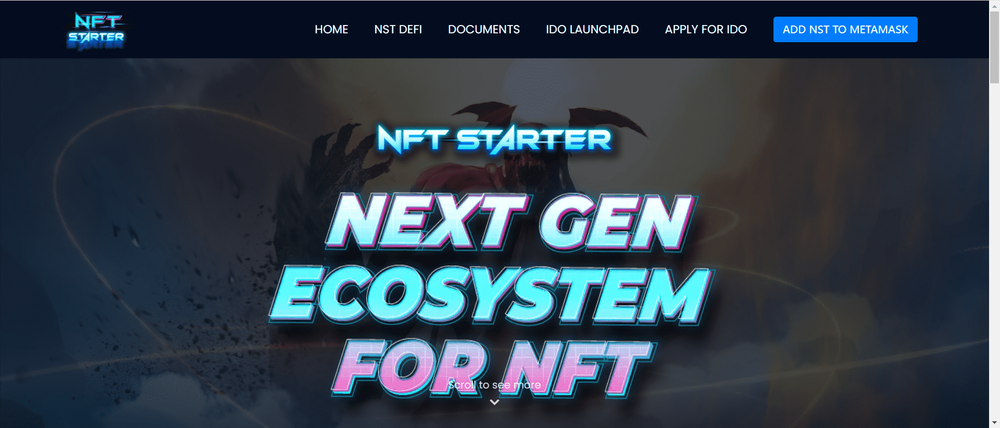

NFT-Starter (NST) 起源于 NFT 启动板平台的先驱，并成为 Crypto 中具有各种时尚功能的时尚设定者。

执行这一愿景的计划首先是与 IDO 启动板一起创建享有盛誉的实时高吞吐量体验，该启动板支持 NFT 项目在成功之路上的发展。

我们优先加入 NST 社区，让大家加入 Farming、Staking、NFT Marketplace、NFT Gaming 等，体验最爽快的体验。NFT-Starter 的角色是作为技术提供者，拥有由 NFT-Starter 社区独家管理的平台。NST持有者有多种好处，例如被动赚取BNB，IDO参与，投票权，农业（流动资金池），赚取评级之星以及未来的许多好处。

