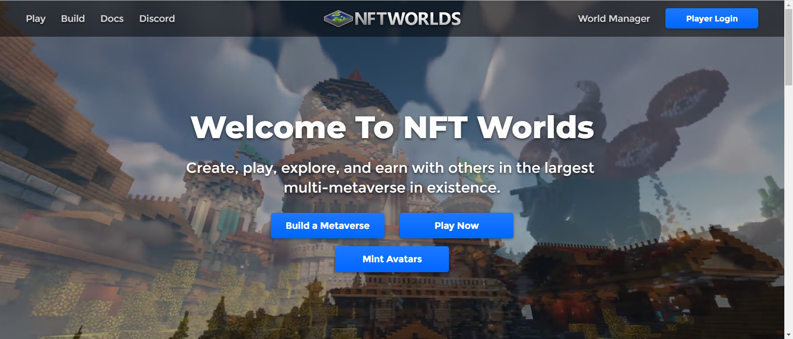

每个 NFT 世界都是一个可探索的、无限的世界，可以构建到任何你能想象到的东西中。

NFT Worlds 与 Minecraft 兼容、大型多人游戏、将拥有开发人员 API、去中心化等等。

发现令人难以置信的元宇宙世界、游戏、新朋友等。世界由玩家拥有和制作。所有世界都在 NFT Worlds 多元宇宙中相互连接。

在 NFT Worlds 中，您能想象到的任何事情都是可能的。

创建游戏、体验、场地、音乐会、社区聚会等。每个世界都是其自己的完全灵活的元宇宙，它与 NFT Worlds 多元宇宙生态系统中的其他世界相互连接。

