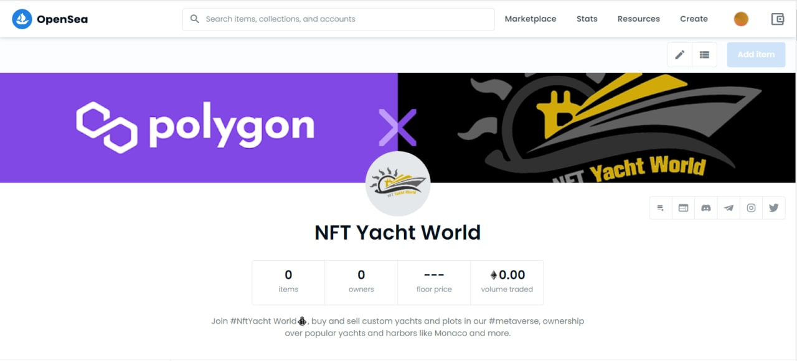

NFT 游艇世界是一个虚拟世界，您可以在其中与世界各地的其他人购买、交易和出售#NFT 游艇、土地等，或者将您的游艇开到公海并前往异国情调的地方，捕捉稀有鱼类和更多的。

代币和 NFT 将在 Polygon 上铸造。

1.多边形

我们将在 Polygon 上铸造所有 NFT 和我们的代币。

2. 虚拟世界

将您的游艇带到开阔的海洋，前往异国他乡，捕捉稀有鱼类等等！

3. 不同质量的 NFT

所有 NFT 都会有不同的质量变体，例如普通、黄金和钻石。

