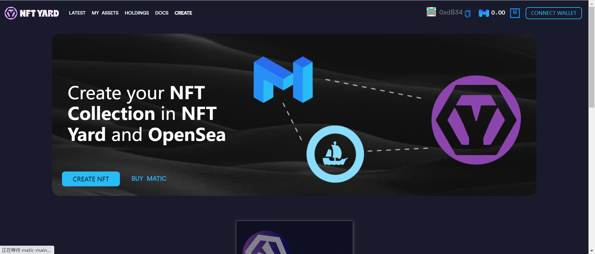

NFT Yard它是在Polygon网络 ( MATIC ) 上开发的NFT或不可替代代币的去中心化应用程序 ( DAPP ) 。它是一个 NFT 工厂和市场，提供完全去中心化的机制来在受支持的以太坊侧链上创建、购买和出售 NFT（非同质代币）。开发的目标是成为一个简单实用的工具，易于使用，以快速、安全和客观的方式促进 NFT 的创建。

在 Polygon 网络上创建，每个人都可以访问，交易价格非常便宜。

创建 NFT 的成本仅为美元货币的几美分。

