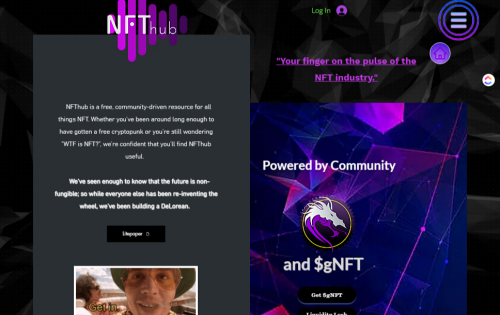

NFThub 致力于简化任何对 NFT 行业充满热情的人的日常生活，并为大规模采用做出贡献，促进可靠的教育，并允许基于真实用户体验的社区管理。

 NFThub 是一个目录、知识库、教育中心、社交网络等等。自公开发布之日起由 DAO 管理，由 NFT 领域的资深人士构建，他们直接是其目标受众的一部分；NFThub 提供了多种强大的功能，所有这些功能都是为了支持、改进和简化 NFT 生态系统中的日常生活而手工选择或专门开发的。

在不久的将来，我们计划推出更多功能，其中一些即将推出：

一个精心策划的 NFT 平台，拒绝率 0% [艺术家将被列入候补名单，入职浪潮将由社区 DAO 投票
“迷你诗”；一个小型但可公开访问的虚拟世界，我们将在其中举办活动、展示创作者的作品，并允许社区为世界本身的设计和布局做出贡献
具有 NFT 奖励的游戏化引导学习轨道
一个人才机构/创意工作室，将知识渊博和才华横溢的创作者与希望进入 NFT 领域的品牌/名人联系起来
由一些世界顶级加密艺术家创造的 NFT 奖励的收益农业

