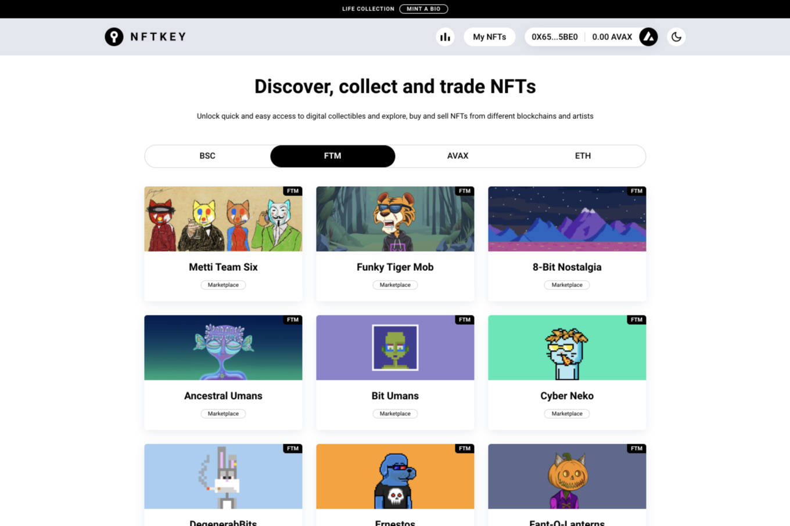

解锁对数字收藏品的快速便捷访问，并探索、购买和销售来自不同区块链和艺术家的 NFT。

我们的链上市场支持多个区块链：BNB Smart Chain、Fantom Opera、Ethereum、Avalanche、Harmony 和 Polygon，无需任何集中式服务器。所有这些事件和动作都写在链上，以实现完全透明和可访问性。

NFTKEY 是一个非托管市场，在您列出 NFT 时不会锁定它们。您仍然可以控制自己的资产。

