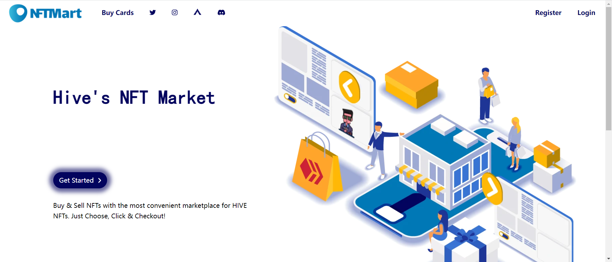

NFTMart 是一个新的 Hive dApp，它允许用户更轻松地买卖 Hive NFT，支持 Hive 的原生货币：Hive 和 HBD。

NFTMart 让卖家和买家可以轻松快速、安全地将 NFT 换成货币，而不必为了获得他们可以使用的货币并发送到交易所而费尽心思！

通过最方便的 HIVE NFT 市场买卖 NFT。只需选择、点击和结帐！是开始买卖 NFT 的最佳平台。它是初学者轻松进入 NFT 的最简单平台。

