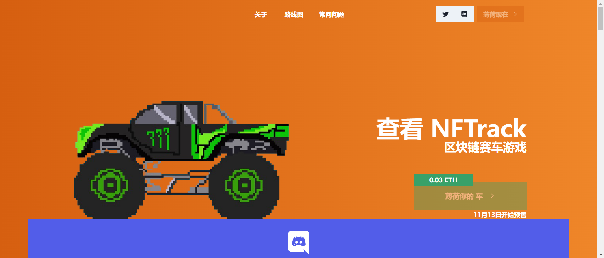

---
title: "NFTrack"
description: "Immutable 上的第一款区块链赛车游戏，包含 10,000 辆随机生成的赛车🏎"
date: 2022-08-18T00:00:00+08:00
lastmod: 2022-08-18T00:00:00+08:00
draft: false
authors: ["浮尘"]
featuredImage: "nftrack.png"
tags: ["NFT Games","NFTrack"]
categories: ["nfts"]
nfts: ["NFT Games"]
blockchain: "Immutable X"
website: "https://nftrackracing.com/"
twitter: "https://twitter.com/NFTrackRacing"
discord: "https://discord.com/invite/X9M2qSXWcE"
telegram: ""
github: ""
youtube: ""
twitch: ""
facebook: ""
instagram: ""
reddit: ""
medium: ""
steam: ""
gitbook: ""
googleplay: ""
appstore: ""
status: "Live"
weight: 
lightgallery: true
toc: true
pinned: false
recommend: false
recommend1: false
---
NFTrack 是一款赛车游戏和 NFT 收藏，拥有 10,000 辆独特的汽车。所有 10,000 辆汽车都是随机生成的，使用数百种不同的特征组合在一起，创造出独一无二的收藏汽车。每辆 NFTrack 赛车都将呈现在我们的赛车游戏中，并将在我们的赛道上竞争以赢得稀有奖品。菜单上有：低赌注比赛和大型玩家锦标赛、即使在睡觉时也能获胜的投注和借贷功能以及其他令人难以置信的功能！NFTrack 生活在 Etherum 区块链上，但没有 GAS 费用！我们在一个名为 Immutable X 的平台上，这是一个允许 0 费用的第 2 层以太坊平台。游戏发布前将仅铸造 10,000 辆 NFTrack 汽车。每个都由 8 种车身类型中的一种和各种定制的汽车零件组成，您一定会爱上 NFTrack 的特殊设计！

