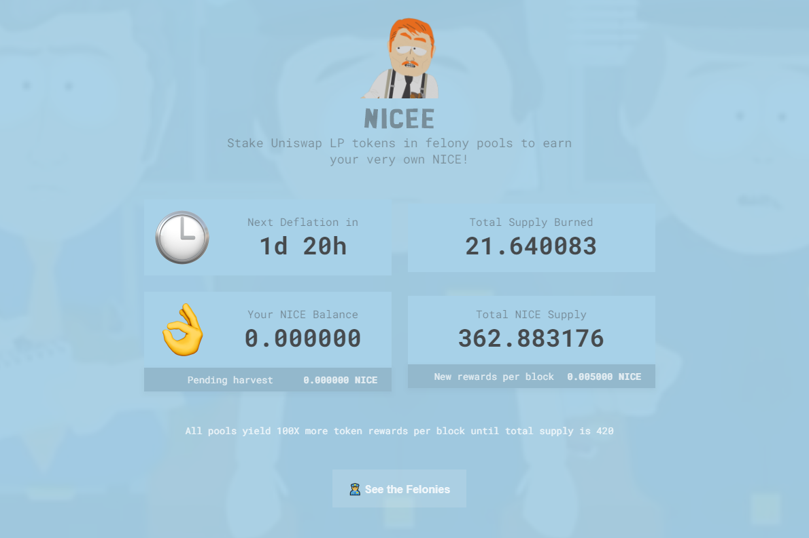

NICE 是一个 SushiSwap 分叉，总供应量在 69 到 420 之间，没有预挖。
一旦供应量超过 420，排放量将自动减少 100 倍，并且燃烧率增加到交易的 20%。一旦供应量低于 69，排放量将自动增加 100 倍，燃烧率降低至 1%。

在重罪池中质押 Uniswap LP 代币以获得您自己的 NICE！

它使用 SushiSwap 合约的精确副本，除了简单的通货膨胀/通货紧缩逻辑，因此合约应该是安全的。但不能保证它们是，使用风险自负。移除 SushiSwap 的迁移器以提高安全性。

