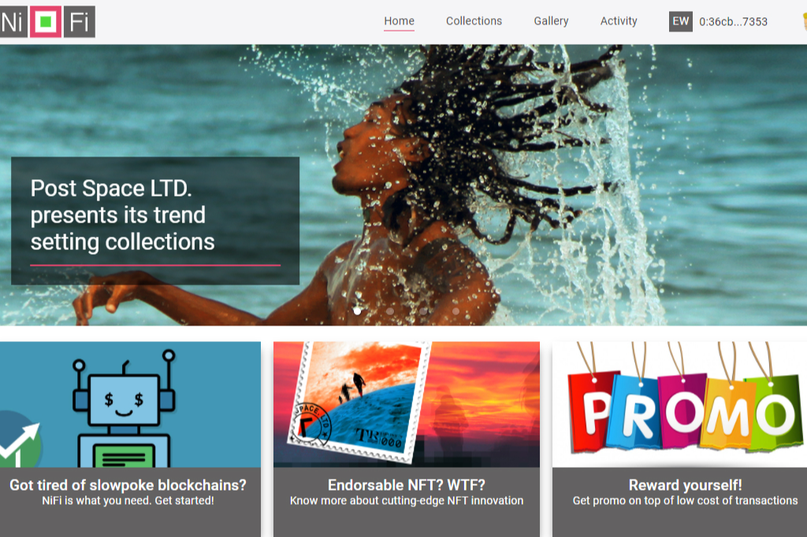

Everscale 区块链上的创新 NFT 市场，可让您创作和销售艺术品。交易成本低，速度快。

NiFi Club 是第一个引入革命性创新的平台——代言。
如果我们结合两个 NFT 会发生什么？在开发数字邮票的概念收藏时，我们想到了这个想法。事实上，传统邮票上标有一些印刷品，以表明它们的用途。如果我们将其转化为 NFT 实践，那么这样的打印应该是 NFT 本身。

此外，而不是利用——反过来——让我们将 NFT 标记为批准或认可。这种认可可以由一些有声望的人发布，或者简单地说 - 由有影响力的人发布。因此，我们在 NFT 所有者和影响者之间建立了新的直接互动。

NiFi Club 在其 NFT 智能合约的新标准中实现了这种方法。

