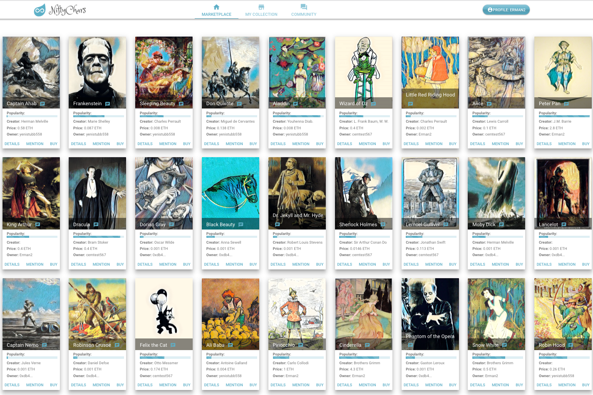

NiftyChars .com 是一个交易者可以购买、出售、交易和讨论数字虚构人物（例如福尔摩斯）的市场。它似乎用以太坊代币模仿稀有的收藏卡，并且这些代币中的每一个都遵循以太坊的 ERC-721 协议。ERC-721 是一个免费的开放标准，描述了如何在以太坊区块链上构建不可替代或独特的代币。虽然大多数代币都是可替代的（在加密货币的情况下，每个代币都与其他代币相同），但 ERC-721 代币都是唯一的。您可以将它们视为稀有的、独一无二的收藏品。

在以太坊上拥有你最喜欢的虚构人物、英雄。您可以收集和交易的数字收藏卡。- 制作精美的艺术品 - 表达自己，玩得开心 - 交易以获取潜在利润 - 完全透明的分布式智能合约 - 新功能即将推出：独立艺术家创作卡片、版画......

