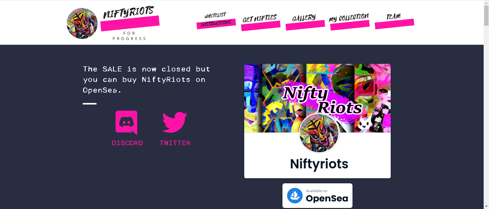

NiftyRiots 为您带来一个以前卫技术为正义事业打造的 NFT 系列。我们的最终目标是由来自边缘群体的艺术家在 Metaverse 中展示艺术。我们应用深度神经网络让世界了解不同的现实。

扎伊尔画廊是元界中的一个艺术画廊，致力于展示少数民族创作的艺术。它将让每个 Rioter 都能欣赏 NiftyRiots 和来自所有社区的客座艺术家制作的涂料艺术。它将在所有 NFT 铸造完成后很快开放。这是我们的目标！

NiftyRiots 希望为有时缺乏机会表达自己声音的社区创造一个友好的对话空间。

