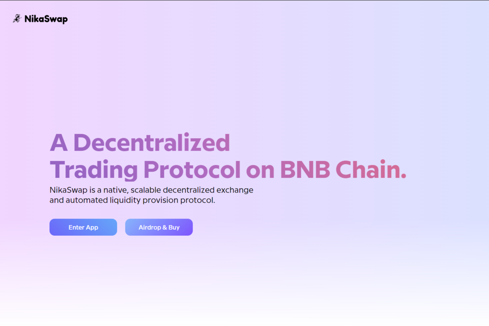

代币信息

代币名称： NIKA

合约地址： 0x9716bce1d79c00b6585697d81ef804bc12191f90

总供应量：1,000,000,000

尼卡分配： 

分配按从大到小的顺序排列：

代币销售： 30% (300,000,000 NIKA)

流动资金池： 30%（300,000,000 NIKA）

生态系统： 30%（300,000,000 NIKA）

营销： 5%（50,000,000 NIKA）

开发： 5%（50,000,000 NIKA）

