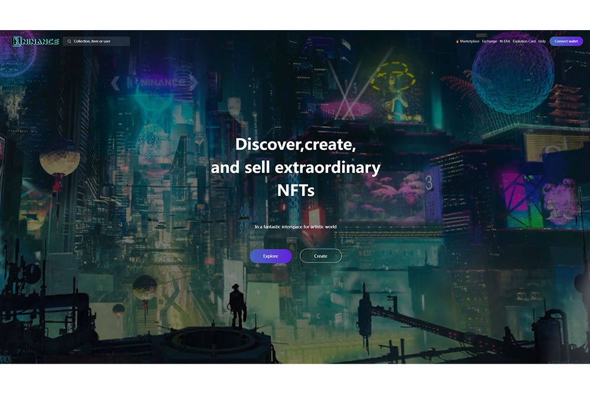

Ninance致力于用区块链技术将全球顶级艺术品变成NFT，打造多元化、一体化的NFT平台，努力为NFT买家、卖家和创作者部署一个快速、高性价比的NFT市场。

在 Ninance 上，任何人都可以轻松地为艺术品和游戏设备等独特的数字资产铸造 NFT，其 NFT 的相关信息和记录将永久存储在 IPFS 上。艺术家无需第三方，顺应当代艺术潮流，自由施展才华，将才华和梦想变为现实，玩得开心赚钱。

