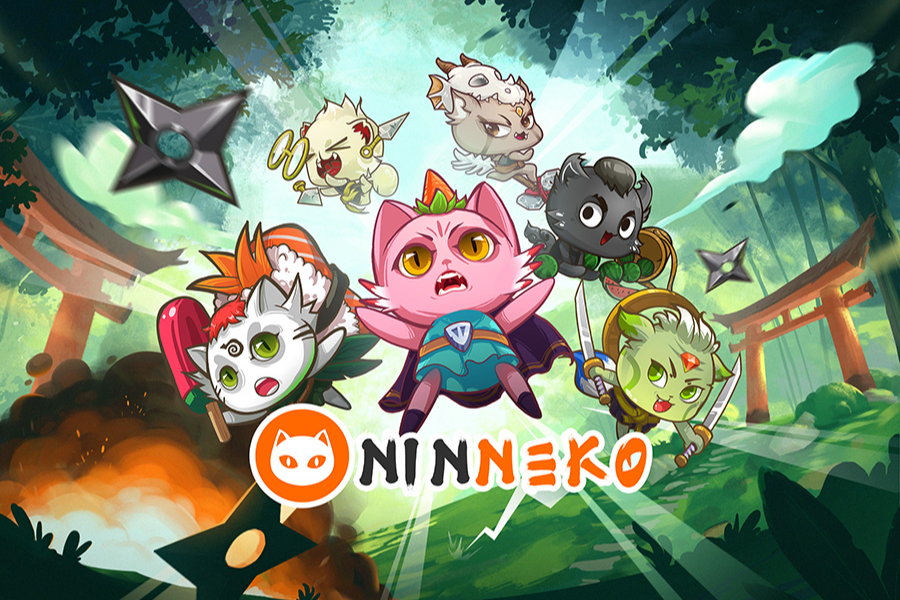

---
title: "Ninneko"
description: "Ninneko是结合Idle RPG玩法和育种系统的NFT游戏前沿。"
date: 2022-08-18T00:00:00+08:00
lastmod: 2022-08-18T00:00:00+08:00
draft: false
authors: ["浮尘"]
featuredImage: "ninneko.png"
tags: ["NFT Games","Ninneko"]
categories: ["nfts"]
nfts: ["NFT Games"]
blockchain: "BSC"
website: "https://ninneko.com/"
twitter: "https://twitter.com/ninnekogame"
discord: "https://discord.com/invite/bw84nfPReK"
telegram: "https://t.me/ninnekogame"
github: ""
youtube: "https://www.youtube.com/channel/UCYiEyZbN7FH4pCrC2Qjn7vQ"
twitch: ""
facebook: "https://www.facebook.com/NinnekoGlobal"
instagram: ""
reddit: ""
medium: ""
steam: ""
gitbook: ""
googleplay: ""
appstore: ""
status: "Live"
weight: 
lightgallery: true
toc: true
pinned: false
recommend: false
recommend1: false
---
Ninneko是Binance Smart Chain上一款迷人的NFT角色扮演游戏，玩家可以通过培养Ninneko，建立阵容通过PvP / PvE战斗和战役击败敌人来赚取收益。

玩家将沉浸在森林深处的神秘村庄中，花费数小时抚养被称为忍者（忍猫）的可爱的忍者猫。

Ninneko是结合Idle RPG玩法和育种系统的NFT游戏前沿。

在市场上召唤、繁殖和交易 Ninnekos

质押 NFT Ninnekos 和 NINO 以赚取和兑换游戏内奖励

与其他玩家交易游戏物品

