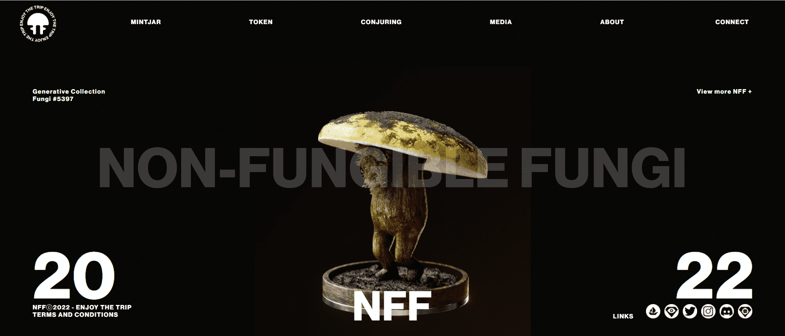

Non-Fungible Fungi 集体是一个由 10,100 个独特的 3D 动画（和魔法）蘑菇 NFT 组成的王国，它们在以太坊区块链中漫步。每个蘑菇都属于 3 种中的 1 种，魔法、沼泽和沼泽标准，其中魔法是最稀有的，而沼泽是最常见的。

100 Genesis Mushroom 为我们提供了祖父特征，从那里我们有许多不同的特征，包括稀有性和外观，构成了 10,000 个生成集合。

