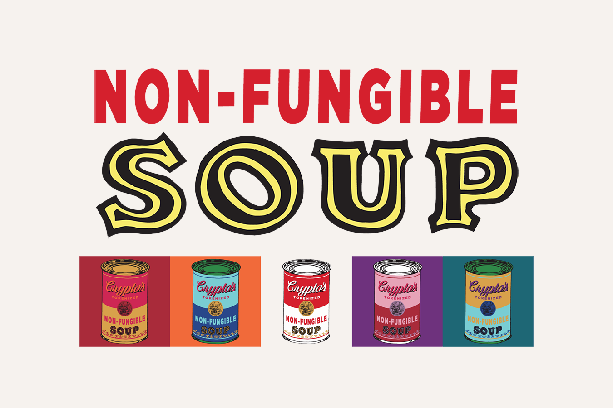

Non-Fungible Soup 是 2048 个受 Warhol 启发的生成向量 NFT 的集合。对沃霍尔调色板和臭名昭著的作品“汤罐”的高保真调查。 

Non-Fungible Soup 是Art101受 Warhol 启发的 NFT PFP 项目。随机铸造 2,048 种独特的“代币化”NFT 汤中的任何一种。没有起始索引或编辑元数据后铸币。

在铸造前查看整个系列，出处是预设的。Non-Fungible Soups 是原生向量，使用svg_stack创建。（每个罐头还包括一个 PNG 哈希。）

有关更多详细信息、掉落和路线图，请访问Art101.io。

