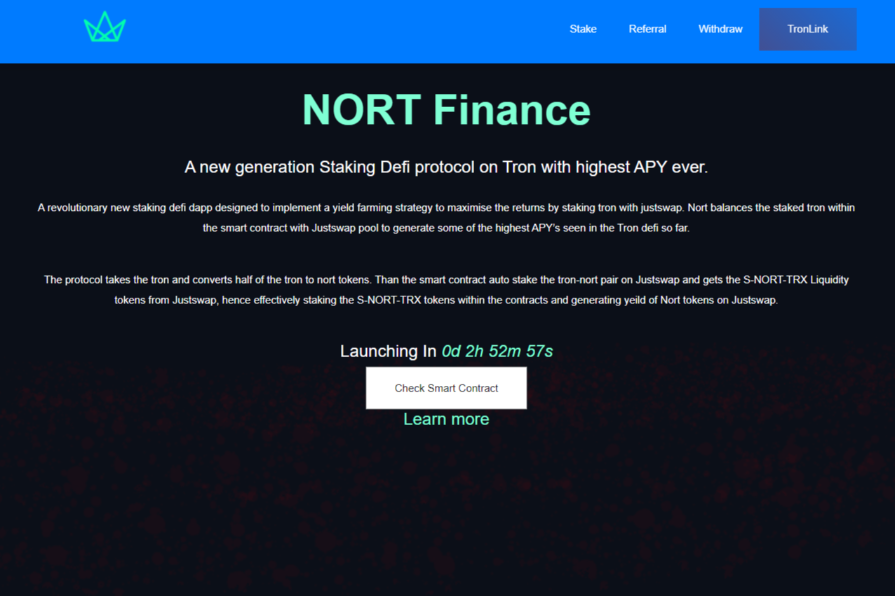

---
title: "NortTRX"
description: "Tron 上的新一代 Staking Defi 协议，APY 最高。"
date: 2022-08-19T00:00:00+08:00
lastmod: 2022-08-19T00:00:00+08:00
draft: false
authors: ["浮尘"]
featuredImage: "norttrx.png"
tags: ["DeFi","NortTRX"]
categories: ["nfts"]
nfts: ["DeFi"]
blockchain: "TRON"
website: "https://nort.finance/"
twitter: "https://twitter.com/NortTRX"
discord: ""
telegram: "https://t.me/NortTrxx"
github: ""
youtube: ""
twitch: ""
facebook: ""
instagram: ""
reddit: ""
medium: ""
steam: ""
gitbook: ""
googleplay: ""
appstore: ""
status: "Live"
weight: 
lightgallery: true
toc: true
pinned: false
recommend: false
recommend1: false
---
一个革命性的新质押defi dapp，旨在实施一种收益农业策略，通过使用justswap质押tron来最大化回报。Nort 将智能合约中的质押 tron 与 Justswap 池进行平衡，以生成迄今为止在 Tron defi 中看到的一些最高 APY。

该协议采用 tron 并将 tron 的一半转换为 nort 代币。智能合约自动在 Justswap 上质押 tron-nort 对并从 Justswap 获得 S-NORT-TRX 流动性代币，因此有效地在合约中质押 S-NORT-TRX 代币并在 Justswap 上生成 Nort 代币的收益。

