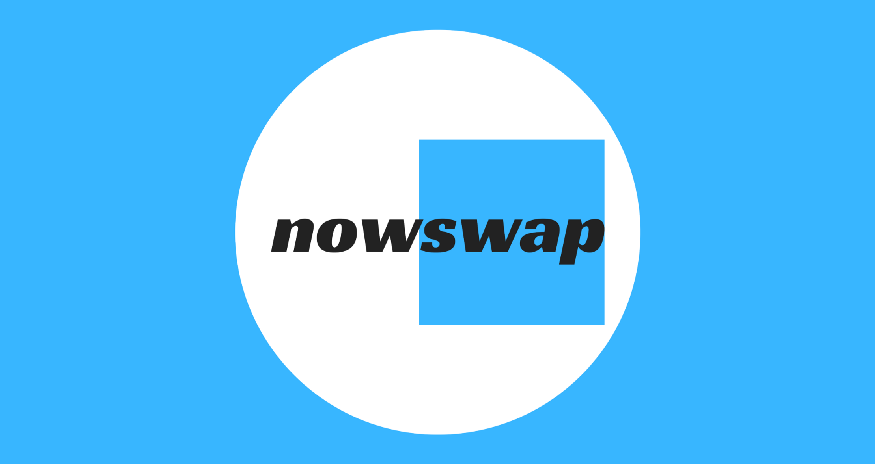

---
title: "Nowswap"
description: "Nowswap 是一种针对小额交易的低交易费用的 Dex。"
date: 2022-08-18T00:00:00+08:00
lastmod: 2022-08-18T00:00:00+08:00
draft: false
authors: ["浮尘"]
featuredImage: "nowswap.png"
tags: ["DeFi","Nowswap"]
categories: ["nfts"]
nfts: ["DeFi"]
blockchain: "ETH"
website: "https://nowswap.org/"
twitter: "https://twitter.com/nowswap_org"
discord: "https://discord.com/invite/B9WnqQTRQb"
telegram: ""
github: ""
youtube: ""
twitch: ""
facebook: ""
instagram: ""
reddit: ""
medium: "https://nowswap.medium.com/"
steam: ""
gitbook: ""
googleplay: ""
appstore: ""
status: "Live"
weight: 
lightgallery: true
toc: true
pinned: false
recommend: false
recommend1: false
---
Nowswap 是业界第一个在以太坊上的去中心化交易协议，它为 3,000 美元以下的小额交易提供低、动态的交易费用，解决了最大的 DEX 用户服务不足的部分。

Nowswap 背后的团队在最大的互联网和加密公司拥有多年经验。

它现在在以太坊上可用并公开！您可以在 https://nowswap.org 上试用。 

