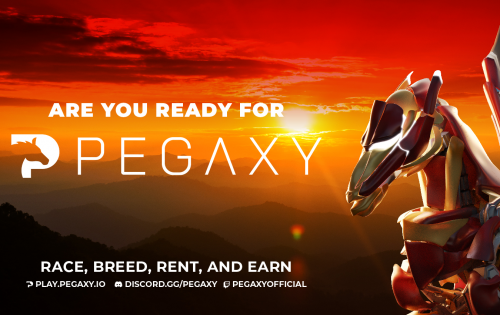
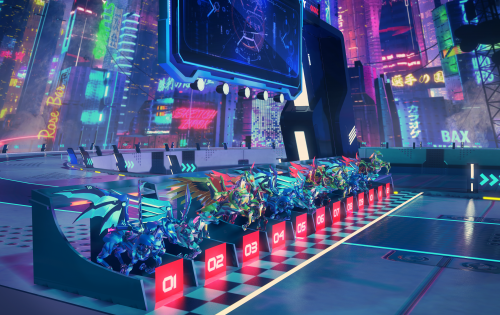

Pegaxy 是一款靠游戏赚钱的 PVP 风格的赛马游戏，玩家可以与其他 15 名赛车手争夺前 3 名。每个种族都有随机的元素变量，包括风、水、火、速度等等。使用战略升级、食物和技能，玩家必须进入前 3 名才能获得平台实用代币 VIS（Vigorus）。

自推出以来，Pegaxy 一直是 Polygon 上的顶级游戏，并且在前 5 个月通过该平台获得了超过 2 亿美元的收入。

在游戏中，玩家可以繁殖、出租、出售，当然还可以与他们的 Pega 比赛以获得 VIS 代币。在构建基于 NFT/区块链的游戏时，该系统已被证明是一种稳健的长期经济方法，因为它使团队能够建立大型公会、奖学金计划，甚至为单人玩家提供通过日常比赛赚取第二收入的机会。

5,000 Founding Pega 的首次销售于 2021 年 10 月举行，同月通过 IDO 推出 PGX。前 5,000 个 Pega 被称为“创始”Pega，因为它们是 Pegaxy 开发团队唯一创建的。#5,000 之后的每个 Pega 都是通过游戏内的育种模型铸造（创建）的。

