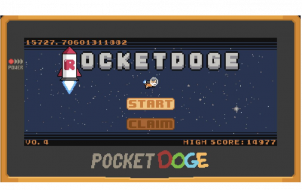

Pocket Doge，你可以随身携带友好的小狗狗！$PDOGE 是 BSC 上首批允许社区内的用户选择和反映他们自己的代币经济学的项目之一。你口袋里的一枚 $PDOGE 代币让你成为世界上最好的！

Pocket Doge 不仅仅是一枚硬币，而是一个愿景。在 Pocket Doge，我们致力于透明度和创新，致力于在加密领域创造一个反映这些核心价值观的空间。Pocket Doge 生态系统广泛而包容，对未来项目的愿景是支持和发展艺术家，并回馈有需要的社区。