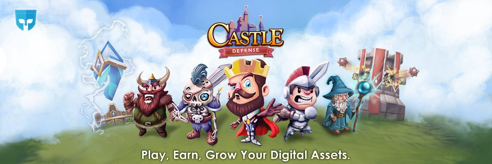

---
title: "PocketArena"
description: "Pocket Arena 是一个基于 Play-to-Earn 的 NFT DApp 游戏门户和平台，通过 NFT 市场支持基于技能的锦标赛和用户生成的 NFT 游戏。"
date: 2022-08-22T14:57:40+08:00
lastmod: 2022-08-22T14:57:40+08:00
draft: false
authors: ["Simon"]
featuredImage: "pocketarena.png"
tags: ["NFT Games","PocketArena"]
categories: ["nfts"]
nfts: ["NFT Games"]
blockchain: ""
website: "https://pocketarena.com/"
twitter: "https://twitter.com/pocketarena"
discord: "https://discord.com/invite/hZSA6jMBfg"
telegram: "https://t.me/swisspoc"
github: ""
youtube: "https://www.youtube.com/c/Pocketarena/"
twitch: ""
facebook: ""
instagram: "https://www.instagram.com/pocketarena/"
reddit: ""
medium: ""
steam: ""
gitbook: ""
googleplay: ""
appstore: ""
status: "Live"
weight: 
lightgallery: true
toc: true
pinned: false
recommend: false
recommend1: false
---
Pocket Arena 是一个基于 Play-to-Earn 的 NFT DApp 游戏门户和平台，通过 NFT 市场支持基于技能的锦标赛和用户生成的 NFT 游戏。Pocket Arena (PA) 由 Pocket Arena 代币“POC”提供支持，这是一种 ERC20 和 BEP20 实用代币，旨在为所有玩家提供真正的奖励，并用作 Pocket Arena DApps 的 NFT 游戏代币。

