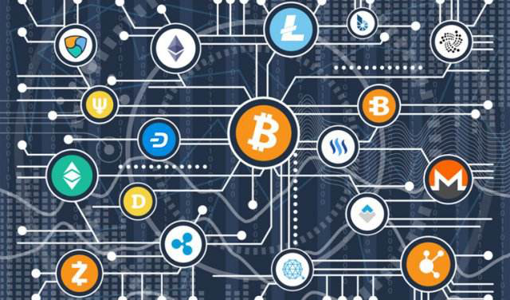

---
title: "POKE25"
description: "Poke是基于eos底层公司上开发的一款去中心化的游戏平台，集游戏、挖矿、股权分红为一体。"
date: 2022-08-22T14:57:40+08:00
lastmod: 2022-08-22T14:57:40+08:00
draft: false
authors: ["Simon"]
featuredImage: "poke25.png"
tags: ["Gambling","POKE25"]
categories: ["nfts"]
nfts: ["Gambling"]
blockchain: "EOS"
website: "https://poke25.com/"
twitter: ""
discord: ""
telegram: ""
github: ""
youtube: ""
twitch: ""
facebook: ""
instagram: ""
reddit: ""
medium: ""
steam: ""
gitbook: ""
googleplay: ""
appstore: ""
status: "Live"
weight: 
lightgallery: true
toc: true
pinned: false
recommend: false
recommend1: false
---
Poke是基于eos底层公司上开发的一款去中心化的游戏平台，集游戏、挖矿、股权分红为一体。玩家使用加密货币EOS进行投注，使用智慧合约建立的经济和数学模型， 充分保证了平台的公平性，利用poke代币让所有玩家共享平台收益，提供了一个真正安全，公平以及趣味性的游戏平台。

