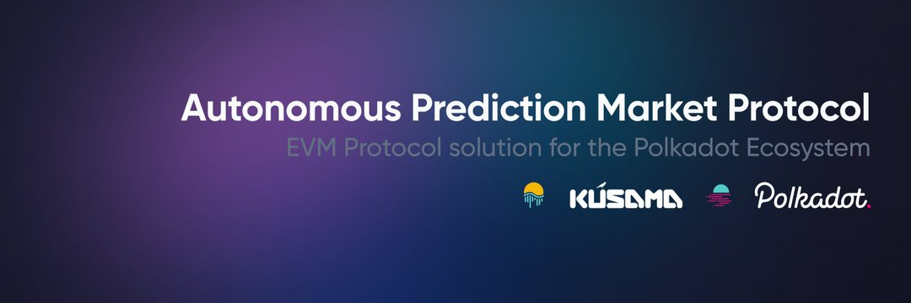

---
title: "Polkamarkets"
description: "Polkamarkets 是一种自主预测市场协议，专为多链信息交换和交易而构建，用户在去中心化和可互操作的 EVM 中对现实世界事件的结果持仓。"
date: 2022-08-22T14:57:40+08:00
lastmod: 2022-08-22T14:57:40+08:00
draft: false
authors: ["Simon"]
featuredImage: "polkamarkets.png"
tags: ["DeFi","Polkamarkets"]
categories: ["nfts"]
nfts: ["DeFi"]
blockchain: ""
website: "https://www.polkamarkets.com/"
twitter: "https://twitter.com/polkamarkets"
discord: "https://discord.com/invite/polkamarkets"
telegram: "https://t.me/polkamarkets"
github: "https://github.com/Polkamarkets"
youtube: ""
twitch: ""
facebook: ""
instagram: ""
reddit: ""
medium: "https://polkamarkets.medium.com/"
steam: ""
gitbook: ""
googleplay: ""
appstore: ""
status: "Live"
weight: 
lightgallery: true
toc: true
pinned: false
recommend: false
recommend1: false
---
Polkamarkets 是一种自主预测市场协议，专为多链信息交换和交易而构建，用户在去中心化和可互操作的 EVM 中对现实世界事件的结果持仓。

在任何与 EVM 兼容的区块链上部署 Polkamarkets 开源工具包——协议、Web 应用程序、javascript SDK 和 API——用于您自己的目的。预测市场是产生可靠预测的有效方式，可以在您的组织内使用或集成到您的产品中。查看我们的用例并与我们交谈以了解更多信息。

Polkamarkets 的技术合作伙伴提供可组合的集成，允许您插入更多功能，从合规性到争议法庭、自动市场解决和更多区块链。Polkamarkets Labs 团队随时为您提供帮助。