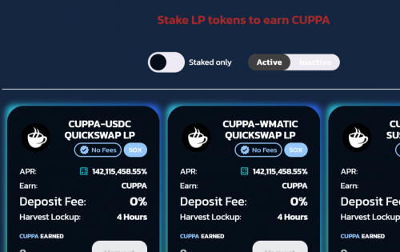

PolyCuppa Finance 是 Polygon Matic 网络上的一个新的 DeFi 项目。这是 PolyBrew 项目的第三层，以 CUPPA 为特色，最大供应量为 50,000 个代币。

在审查了几种单产农业模式后，我们决定在我们的平台上采用低排放率、低供应、分层农业方法。这种模式将帮助最终用户在很长一段时间内获得最大收益。

**PolyCuppa Finance 特征**

- 50,000 个 CUPPA 代币
- 0.005 发射
- 为 MOCHA 和 CUPPA 代币持有者持续赚钱的分层耕作
- dex（QuickSwap 和 SushiSwap）
- 3% 推荐

