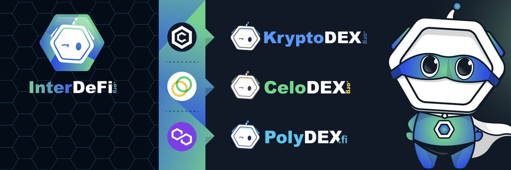

---
title: "PolyDEX"
description: "PolyDEX 是 Polygon Network 上最新的 AMM。它旨在成为支持多链IDO和IFO的首选平台。"
date: 2022-08-23T14:57:40+08:00
lastmod: 2022-08-23T14:57:40+08:00
draft: false
authors: ["Simon"]
featuredImage: "polydex.png"
tags: ["Exchanges","PolyDEX"]
categories: ["nfts"]
nfts: ["Exchanges"]
blockchain: "Polygon"
website: "https://www.polydex.fi/"
twitter: "https://twitter.com/polydexfi"
discord: "https://discord.com/invite/WtksUPQSRm"
telegram: "https://t.me/polydexfi"
github: ""
youtube: ""
twitch: ""
facebook: ""
instagram: ""
reddit: ""
medium: "https://medium.com/polydex%20%E2%80%8C"
steam: ""
gitbook: ""
googleplay: ""
appstore: ""
status: "Live"
weight: 
lightgallery: true
toc: true
pinned: false
recommend: false
recommend1: false
---
PolyDEX 是 Polygon Network 上最新的 AMM。它旨在成为支持多链IDO和IFO的首选平台。在 PolyDEX 上启动的项目将受益于广泛的服务，包括 Staking Pools、Trading Battle、NFT 市场等。

它还通过创新的游戏化农业机制和广泛的投资范围在 Polygon 上提供单产农业。PolyDex 允许用户在 Polygon Network 上交换代币、通过农业提供流动性以及赚取费用和推荐。