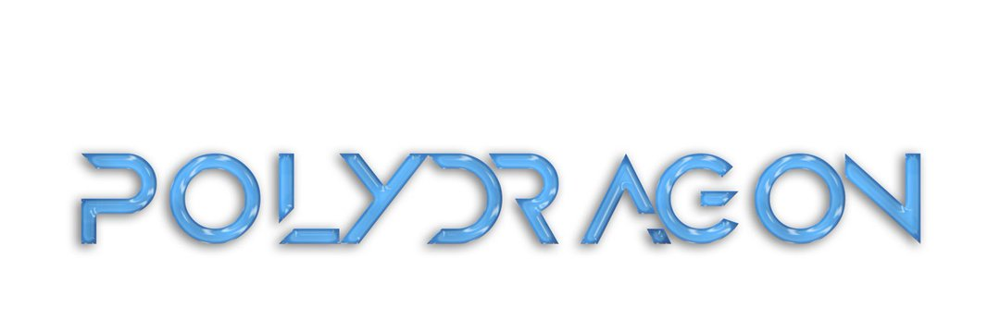

$FIRE 为我们革命性的质押池和收益农场提供动力。它利用专门的 RFI 代币结构实现无限池奖励，同时保持固定供应。作为 RFI 代币，$FIRE 使用一个公平的系统，以恒定的百分比对每笔代币交易征税。这会补充收益农场和质押奖励池，并将奖励重新分配给持有者，为其用户创造更多价值。

在 $FIRE 的启动阶段，50% 的供应被发送到代币合约以获得农场/质押池奖励。通过将 $FIRE 发送到该合约，它成为 $FIRE 持有者 - 与所有其他 $FIRE 持有者一样，它收到所有 $FIRE 交易费用的一部分，以补充奖励供应。