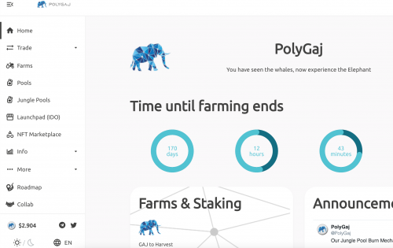

---
title: "PolyGaj Finance"
description: "Polygaj 是围绕两个代币 GAJ 和 GMAM 构建的 DeFi 和 NFT 产品生态系统中的第一个产品。"
date: 2022-08-23T14:57:40+08:00
lastmod: 2022-08-23T14:57:40+08:00
draft: false
authors: ["Simon"]
featuredImage: "polygaj-finance.png"
tags: ["DeFi","PolyGaj Finance"]
categories: ["nfts"]
nfts: ["DeFi"]
blockchain: "Polygon"
website: "http://ww25.polygaj.finance/"
twitter: "https://twitter.com/polygaj"
discord: ""
telegram: "https://t.me/polygajANN"
github: ""
youtube: ""
twitch: ""
facebook: ""
instagram: ""
reddit: ""
medium: "https://polygaj.medium.com/"
steam: ""
gitbook: ""
googleplay: ""
appstore: ""
status: "Live"
weight: 
lightgallery: true
toc: true
pinned: false
recommend: false
recommend1: false
---
Polygaj 是围绕两个代币 GAJ 和 GMAM 构建的 DeFi 和 NFT 产品生态系统中的第一个产品。

GAJ 代币旨在成为 DeFi 产品系列的核心，Polygaj 是第一个 dapp。其他产品将在未来几周内推出。GMAM 代币将成为 NFT + DeFi 产品系列的核心。这将包括 NFT Staking、农业等。

Polygaj 希望为 GAJ 和 GMAM 代币建立一个长期且可持续的愿景，其中将包括 DeFi 和 NFT 交叉点的创新产品。

